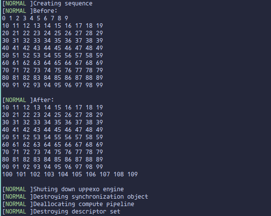

<div style="display: flex; align-items: center;">
  
  <h1 style="margin: 0;">Uppexo</h1>
</div>

## Unified Performant Potato Execution Engine without Optimization


**A general purpose Vulkan engine for rendering and computing**

It has high flexibility and modular design. It fits almost every scenario, from 3D rendering to machine learning. In other word, users can customized the engine layout and suits their needs. 

### This engine may suits you if you want:
- Minimal to almost no boilerplate code 
- To harness power of Vulkan without seeing a single line of vulkan code

### Features
- Easy to use
- High performance
- The design is very human

### Showcase
| Forward rendering                 | Adding operation using compute shader                 |
|-------------------------|-------------------------|
|  |  |

### Demo Code

```cpp 
#include <uppexo.hpp>

int main(void) {
  // create uppexo engine
  uppexo::Uppexo uppexoEngine({0, 0}, "uppexo demo", true);

  // create logical device and queue
  auto device = uppexoEngine.addDevice();
  auto computeQueue = device.addQueue(uppexo::compute);
  device.create();

  // create two SSBO buffer
  auto buffer = uppexoEngine.addBuffer(device);
  int inputBuffer = buffer.addCell(
      uppexo::presetBufferCellBlueprint::SSBO_at_device(sizeof(int) * 100));
  int outputBuffer = buffer.addCell(
      uppexo::presetBufferCellBlueprint::SSBO_at_device(sizeof(int) * 100));
  buffer.create();
}
```

### Documentation
WIP

### Caveats

This Vulkan engine is primarily developed for personal use and has been designed to match my chaotic taste. However, I do not recommend using it in critical projects. For more professional and robust Vulkan libraries, consider exploring alternatives like [Liblava](https://github.com/liblava/liblava).
